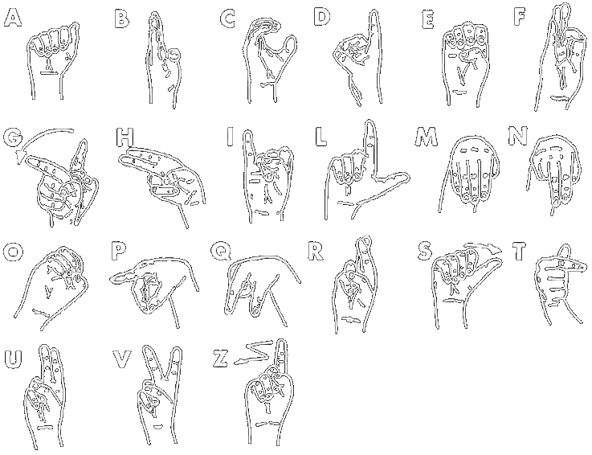

# Real-time Sign Language Detection

Real-time Sign Language Detection is a Python based project that provides all the steps required to produce the dataset required to train a nural network, train it and later use it for gesture recognition in real-time.
The input of gestures is only considered valid if a face is detected withing the image frame containing the gesture, else the input is ignored.

Here's a quick demo of the SignDetection.py script:  

https://user-images.githubusercontent.com/73691795/129217755-e0e2e49b-19cd-46df-ad59-bc2dc5acc473.mp4

## Installation

The version of Python used is Python 3.9.6, which can be installed following this guide:
[Python install](https://www.python.org/downloads/)

The version of OpenCV used for this project is version 4.5.3, which can be installed using the shell command:  
```bash
pip install opencv-python==4.5.3
```

For installing Jupyter Notebook, use the shell command:  
```bash
pip install notebook
```
Be sure to activate the local server necessary to run jupyter notebooks, using the shell command:  
```bash
jupyter notebook
```
Then, from the URL [Jupyter Notebook Tree](http://127.0.0.1:8888/tree) you'll be able to select notebooks to run. 

For installing Tensorflow, required to train the neural network, I suggest to check out the official guide:  
[Tensorflow installation](https://www.tensorflow.org/install)  

For installing LabelImg and learning how to use it, I suggest the GitHub repository of the project:  
[LabelImg GitHub](https://github.com/tzutalin/labelImg)  

For installing Apache MXNet, required to run the gaze prediction model, use the shell command:  
```bash
pip install mxnet
```
or follow the official guide:  
[Apache MXNet installation](https://mxnet.apache.org/versions/1.7.0/get_started?)

The compiler used to process the LaTeX documentation is MiKTeX, which can be installed at the following link (although any LaTeX compiler can be used):  
[MiKTeX installation](https://miktex.org/download)

## Usage

When not specifically stated, all shell commands should be run from the root directory of the project.

To generate the dataset to be used to train a model, refer to the Jupyter notebook [GenerateDataset.ipynb](GenerateDataset.ipynb)

To label the dataset images and train the model, refer to the Jupyter notebook [LabelDataset.ipynb](LabelDatasetAndTrain.ipynb)

To generate a custom HSV profile to be used for skin tone thresholding, either refer to the Jupyter notebook [CreateHSVProfile.ipynb](CreateHSVProfile.ipynb), or run the python script using the shell command:
```bash
python CreateHSVProfile.py
```

To run the sign detection algorithm, either refer to the Jupyter notebook [SignDetection.ipynb](SignDetection.ipynb), or run the python script using the shell command:
```bash
python SignDetection.py
```
The script recognizes all the letters in the standard Italian alphabet, plus four special control gestures which are registered as specific couples of characters detected in quick succession:
- space: Do an "A" gesture followed by an "S" gesture. Simply quicky move your thumb out from the A position. Appends a space to the active string buffer.
- delete: Do a "V" gesture followed by a "U" gesture. Similar to the metaphorical action of "cutting". Deletes the last character in the active string buffer.
- clear: Do an "E" gesture followed by an "A" gesture. Similar to the action of crushing something with your hand. Deletes all the characters in the active string buffer.
- enter: Do a "D" gesture followed by an "O" gesture. Similar to the action of clicking a camera's shutter button. Prints the active string buffer to stdout, then deletes all the characters in the active string buffer.  



Moreover, the [SignDetection.ipynb](SignDetection.ipynb) can be run passing as argument "--Debug", which inserts in the output frames the facial feature recognition dots, eye circles and gaze direction vectors:
```bash
python SignDetection.py --Debug
```

## Contributing
Contribution to the project is welcome, although the project won't be maintained in the future by the development team.

## Authors and Acknowledgement

The project has been developed by Angela D'Antonio, Federica Moro and Marzio Vallero as part of the [Computer Engineering Masters Degree](https://didattica.polito.it/pls/portal30/sviluppo.offerta_formativa.corsi?p_sdu_cds=37:18&p_lang=EN) exam [Image Processing and Computer Vision](https://didattica.polito.it/pls/portal30/gap.pkg_guide.viewGap?p_cod_ins=01TUJOV&p_a_acc=2021), taught by professors B. Montrucchio and L. De Russis, during the academic year 2020/2021 at the [Polythecnic of Turin](https://www.polito.it/).

## License
For right to use, copyright and warranty of this software, refer to this project's [License](License.md)
